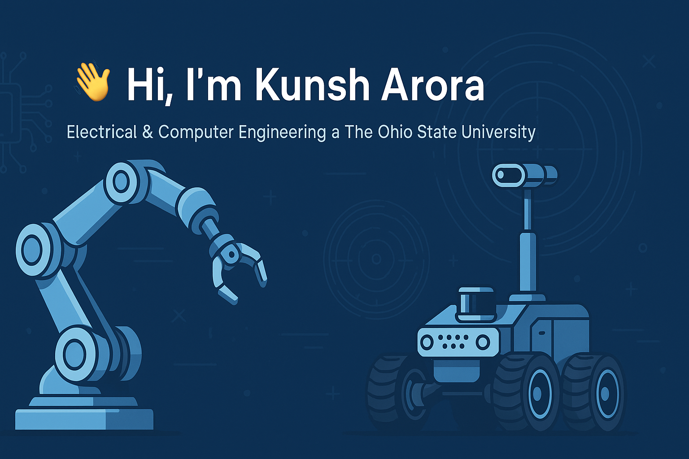

# 👋 Hi, I’m Kunsh Arora  

  
  
  

🎓 **Electrical & Computer Engineering @ The Ohio State University (Dec 2025)**  
🔧 Robotics • Embedded Linux • ROS2 • Raspberry Pi • LiDAR • Depth Cameras • Yocto • SolidWorks  

---

##  Key Projects  
-  **[PiCARWEBFINAL](https://github.com/KunshArora912/PiCARWEBFINAL)** — Latest iteration of your ROS2 + Raspberry Pi–based 4WD robot with LiDAR, web tele-operation, and simulation features. *(Updated Sep 5, 2025)*  
-  **[PiCarWebsiteFinal](https://github.com/KunshArora912/PiCarWebsiteFinal)** — Complementary web system for your robot interface. *(Updated Sep 5, 2025)*  
-  **[PiCarWeb](https://github.com/KunshArora912/PiCarWeb)** — The earlier version with Flask-based control and URDF/Gazebo integration. *(Updated Sep 4, 2025)*  
-  **[PiCar](https://github.com/KunshArora912/PiCar)** — CSS frontend project supporting your robotics stack. *(Updated Aug 27, 2025)*  
-  **[CapstoneProject](https://github.com/KunshArora912/CapstoneProject)** — Robotic Waiter: CAPSTONE project integrating Raspberry Pi + Google Coral + CV/ML navigation. *(Updated Apr 15, 2025)*  
-  **[Mood_detection](https://github.com/KunshArora912/Mood_detection)** — A Python-based mood prediction system. *(Updated Aug 14, 2024)*  
-  **[Mass_Email_Sender](https://github.com/KunshArora912/Mass_Email_Sender)** — Python tool to send bulk emails. *(Updated Aug 12, 2024)*  
-  **[instagram-auto-follow-bot](https://github.com/KunshArora912/instagram-auto-follow-bot)** — Insta-follow automation script. *(Updated Aug 12, 2024)*  
-  **[Translator](https://github.com/KunshArora912/Translator)** — A real-time language translation tool. *(Updated Aug 11, 2024)*  
-  **[Stock-Prediction](https://github.com/KunshArora912/Stock-Prediction)** — Python-based stock forecasting model. *(Updated Aug 6, 2024)*  
-  **[Extractor](https://github.com/KunshArora912/Extractor)** — Data extraction utilities in Python. *(Updated Aug 6, 2024)*  
-  **[ReactTest](https://github.com/KunshArora912/ReactTest)** — A JavaScript/React experimentation repo. *(Updated Aug 1, 2024)*  
-  **[KunshArora912](https://github.com/KunshArora912/KunshArora912)** — Config files power your GitHub profile. *(Updated Jul 25, 2024)*  
-  **[DiceBettingGame](https://github.com/KunshArora912/DiceBettingGame)** — A fun JS-based dice betting app. *(Updated Jul 25, 2024)*  
-  **[-100DaysOfCode-Challenge](https://github.com/KunshArora912/-100DaysOfCode-Challenge)** — Your 100-day code challenge journey in JS. *(Updated Jul 11, 2024)*  
-  **[WebDev_story](https://github.com/KunshArora912/WebDev_story)** — A personal web development showcase. *(Updated Jun 23, 2024)*  

---

##  Experience  
- **Field Technician @ Cartken** — Fixed 20+ delivery robots weekly, built PCB test rigs, and tackled persistent reliability challenges.  
- **Founder @ Disbound** — Developed a social media MVP, pitched to OSU PBA.  
- **Cybersecurity Intern @ Cerner** — Created Wi-Fi deauth-attack detection tools and presented insights to 50+ stakeholders.  
- **Member @ Buckeye AutoDrive** — Part of OSU’s SAE/GM self-driving car competition team.  

---

## 🛠 Tech Stack  
  
  
  
  
  
  
  
  
  
  

---

##  Achievements  
- 🥇 Winner — MakeOHI/O HAMMERli Challenge (NSF ERC)  
- 🥈 2nd Place — OSU Fundamentals of Engineering Design Challenge  

---

##  GitHub Stats  
  
  

---

##  Beyond Tech  
Electronics • Robotics • AI/ML • Cloud • Embedded Linux • Cricket 🏏 • Chess ♟️  

---

> “I love turning schematics, code, and CAD models into robots that move, think, and solve problems in the real world.”

